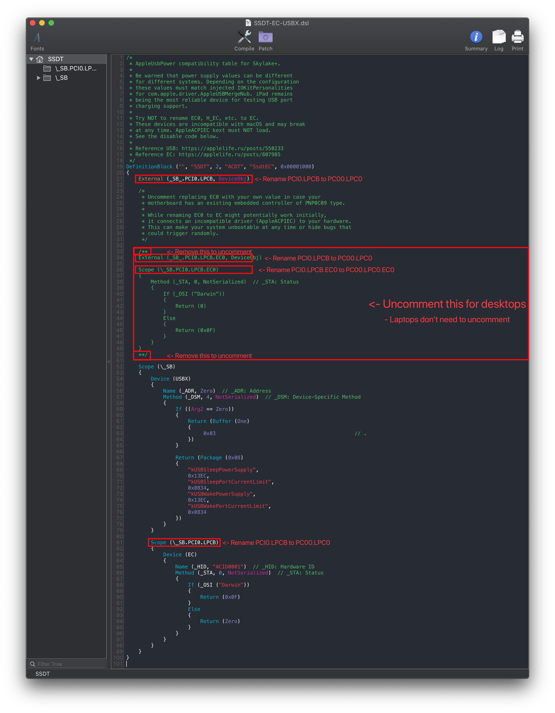
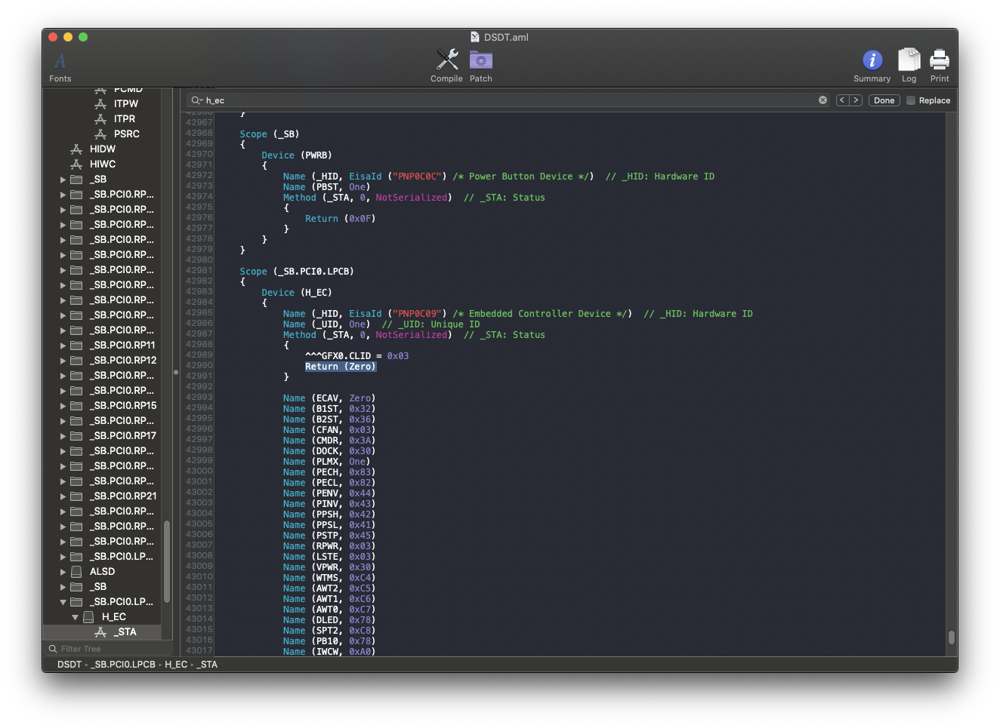

# Fixing Embedded Controllers: Manual

- [Fixing Embedded Controllers: Manual](#fixing-embedded-controllers-manual)
  - [Finding the ACPI path](#finding-the-acpi-path)
    - [DSDT](#dsdt)
    - [DeviceManager](#devicemanager)
  - [Edits to the sample SSDT](#edits-to-the-sample-ssdt)
  - [Edge Cases](#edge-cases)
    - [Multiple PNP0C09's show up](#multiple-pnp0c09s-show-up)
    - [No PNP0C09 show up](#no-pnp0c09-show-up)
    - [PNP0C09 already named `EC`](#pnp0c09-already-named-ec)
    - [PNP0C09 already has an `_STA` method](#pnp0c09-already-has-an-_sta-method)
  - [Compiling the SSDT](#compiling-the-ssdt)
  - [Wrapping up](#wrapping-up)

TO-DO:

* Finish Edge cases and sample SSDT edits

## Finding the ACPI path

To find the ACPI pathing, you have 2 methods:

* [DSDT](#DSDT)
* [DeviceManager](#devicemanager)

### DSDT

Finding the ACPI pathing is quite easy actually, first open your decompiled DSDT you got from [Dumping the DSDT](/Manual/dump.md) and [Decompiling and Compiling](/Manual/compile.md) with either maciASL(if in macOS) or any other text editor if in Windows or Linux(VSCode has an [ACPI extension](https://marketplace.visualstudio.com/items?itemName=Thog.vscode-asl) that can also help).

Next, search for `PNP0C09`. You should get something similar:


From the above example we see 2 main things:

* Name of our embedded controller
  * In this case being `EC0`
* Pathing of our embedded controller
  * `PC00.LPC0`

But now we get into edge case territory, what fun!

The main ones to check for are:

- [Fixing Embedded Controllers: Manual](#fixing-embedded-controllers-manual)
  - [Finding the ACPI path](#finding-the-acpi-path)
    - [DSDT](#dsdt)
    - [DeviceManager](#devicemanager)
  - [Edits to the sample SSDT](#edits-to-the-sample-ssdt)
  - [Edge Cases](#edge-cases)
    - [Multiple PNP0C09's show up](#multiple-pnp0c09s-show-up)
    - [No PNP0C09 show up](#no-pnp0c09-show-up)
    - [PNP0C09 already named `EC`](#pnp0c09-already-named-ec)
    - [PNP0C09 already has an `_STA` method](#pnp0c09-already-has-an-_sta-method)
  - [Compiling the SSDT](#compiling-the-ssdt)
  - [Wrapping up](#wrapping-up)

If none of the above apply to you, you're ready for the next section:

### DeviceManager

If you already have Windows installed on this machine, finding the EC pathing is fairly easy.

Start by opening up Device Manager in Windows and looking for a device named `Embedded Controller`. Once found, click on it and select the `BIOS device Name` entry. You should get something like this:


From the above, we can see that our pathing is `SB.PC00.LPC0.EC0`

Now with the pathing, you can head here: [Edits to the sample SSDT](#edits-to-the-sample-ssdt)

## Edits to the sample SSDT

Now that we have our ACPI path, lets grab our SSDT and get to work:

* [SSDT-EC-USBX](https://github.com/acidanthera/OpenCorePkg/blob/master/Docs/AcpiSamples/SSDT-EC-USBX.dsl)
  * For Skylake and newer and all AMD systems
* [SSDT-EC](https://github.com/acidanthera/OpenCorePkg/blob/master/Docs/AcpiSamples/SSDT-EC.dsl)
  * For Broadwell and older
  
  
Now when opening this SSDT, you'll notice a few things. Mainly:

* Some code is commented out
  * This is code for disabling our EC
  * Laptops users **SHOULD NOT** uncomment this
* There's a new EC called `Device (EC)`
  * **DO NOT RENAME THIS**, this will be the EC we give to macOS
  
**Before**:

```
External (_SB_.PCI0.LPCB, DeviceObj) <- Rename this

Scope (_SB.PCI0.LPCB) <- Rename this
```



Following the example pathing we found, the SSDT should look something like this:

**After**:

```
External (_SB_.PC00.LPC0, DeviceObj) <- Renamed

Scope (_SB.PC00.LPC0) <- Renamed
```


## Edge Cases

### Multiple PNP0C09's show up

When multiple PNP0C09 show up, we need to next check for the following properties:

* `_HID` (Hardware ID)
* `_CRS` (Current Resource Settings)
* `_GPE` (General Purpose Events)

What these signify is whether this PNP0C09 device is real or not, as per the [ACPI spec](https://uefi.org/sites/default/files/resources/ACPI_6_3_final_Jan30.pdf). So one's matching the above criteria are the one's we want to disable.

* Note: If _STA shows up as well, you'll need to go here: [PNP0C09 already has an `_STA` method](#pnp0c09-already-has-an-sta-method)

### No PNP0C09 show up

When this happens, you'll only need to create a "dummy" EC for macOS.

Try searching for any devices named: "LPCB", "LPC0", "LPC", "SBRG", "PX40". If you have any of these, try using the LPC pathing of each of those device in place of the Embedded Controller's pathing.

Note that **DO NOT** uncomment the EC disaling code as there are no devices that is considered "EC" in your machine.

### PNP0C09 already named `EC`

Congrats! No need to create an SSDT-EC! However you will still want USBX if you're skylake or newer.

Prebuilt can be grabbed here: [SSDT-USBX.aml](https://github.com/dortania/USB-Map-Guide/blob/master/extra-files/SSDT-USBX.aml)

### PNP0C09 already has an `_STA` method

This is the equivalent of not having an EC as we can't control it with our SSDT-EC, instead we'll need to create a "dummy" EC for macOS. You'll still want to find the PCI and LPC pathing for this device. So follow the guide as if you were creating a laptop SSDT-EC/USBX. 

Example of an EC with STA already:



## Compiling the SSDT

 With the SSDT done, you're now [ready to compile the SSDT!](/Manual/compile.md)

## Wrapping up

Once you're done making your SSDT, either head to the next page to finish the rest of the SSDTs or head here if you're ready to wrap up:

* [**Cleanup**](/cleanup.md)
